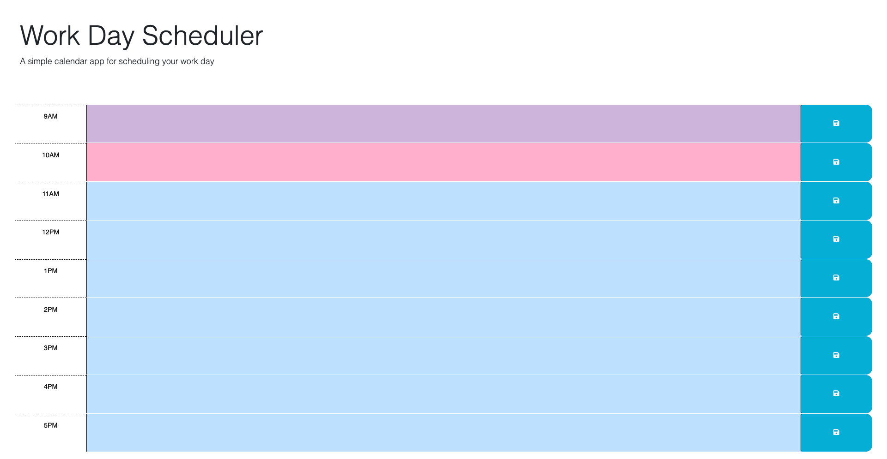

# WorkDayScheduler

A simple calendar application that allows a user to save events for each hour of a typical working day (9am–5pm)

## Upcoming Iterations

1. If there are future iterations of this project, it will expand to an entire 12 hour scheduler

2. If used, potentially changing color scheme to fill user requirements

## Image of Work Day Sheduler

## WorkDayScheduler Repo:

https://github.com/fswDevSteph/WorkDayScheduler

## Link to deployed project:

https://fswdevsteph.github.io/WorkDayScheduler/

## Installation instructions:

N/A

## Contributers

Tutors and Class assitance personal.
Names unknown.

## Known Issues:

N/A

## About Developer:

Stephanie Perroni is a full stack software development student who hopes to make meaningful and positively impactful contributions in the software development space.
